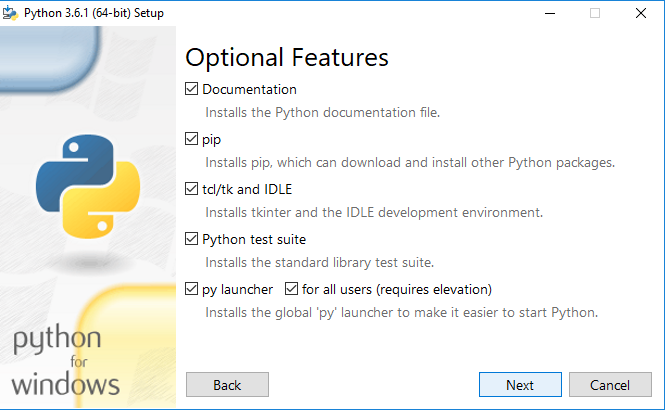
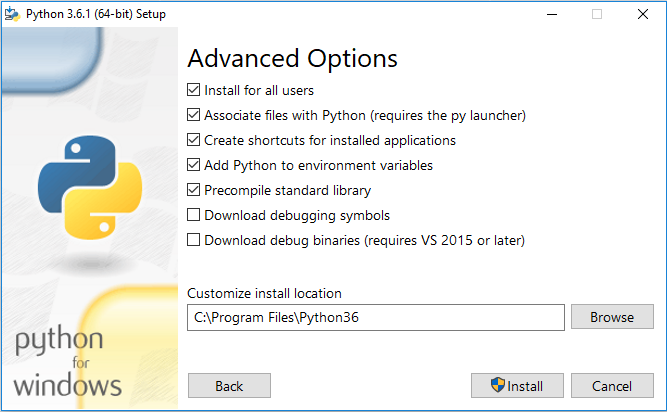
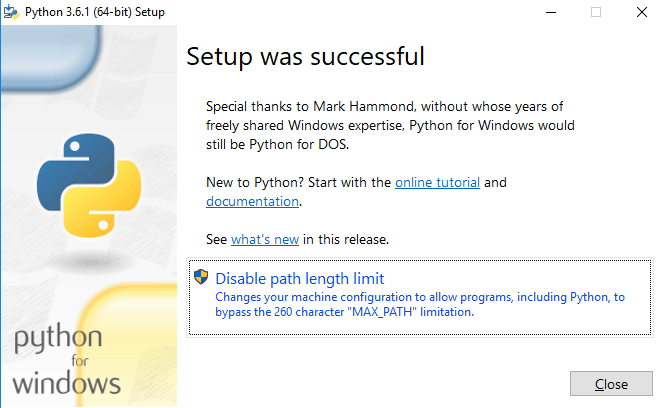

Instalando Python
=================

.. todo:: como instalar o python, em Linux, MacOS e windows

**Windows**

Primeiramente, deve-se obter o arquivo de instalaçao compatível com a arquitetura, x86 deve funcionar em todos, os links estão a seguir:

x86_64: https://www.python.org/ftp/python/3.6.1/python-3.6.1-amd64.exe

x86:    https://www.python.org/ftp/python/3.6.1/python-3.6.1.exe

A seguir, o aquivo deve ser executado e a seguinte imagem aparecera:

.. figure:: images/install1.png
   :align: center
   :scale: 80%

Deve ser selectionado a opção 'Add Python 3.X to PATH', e deve ser clicado na opção 'Customize installation'

Clicar en 'Next'

Selectionar a opção: 'Install for all users' e clicar em 'Install', uma janela pedindo permissão de administrador deve aparecer, é necessário aceitar

Clicar em 'Disable path lenght limit', novamente, uma janela de permissão de administrador vai aparecer, é necessário aceitar

.. figure:: images/install5.png
   :align: center
   :scale: 80%

Clicar em 'Close'

Parabéns, agora o Python está intalado em sua máquina!
