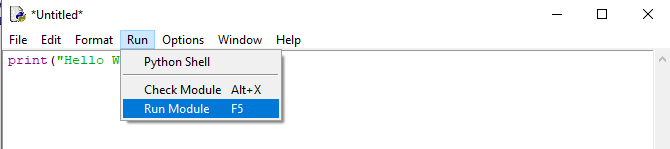

Introdução
==========

.. todo:: dar uma introduzida no assunto, talvez só copiar o texto do doc
          do SESC. Ou não

É muito comum apresentar uma nova linguagem com um exemplo simples que mostra
na tela as palavras Hello World. Antes de adentrar o mundo do Python, vamos
ver como outras linguangens de programação o implementam:

**C**

.. code:: C

   #include <stdio.h>

   int main(int argc, char *argv[]){
       printf("Hello, world\n");
       return 0;
   }

**Java**

.. code:: java

   public class Hello {
         public static void main(String []args) {
            System.out.println("Hello World");
         }
   }

* É obrigatório colocar o programa em um arquivo chamado Hello.java

**Pascal**

.. code:: pascal

   program HelloWorld;

   begin
       writeln('Hello World');
   end.

**Python**

Vamos ver como é o Hello World em Python, escreva este texto abaixo com o
shell do python aberto e clique enter:

.. doctest::

   >>> print("Hello, World!")
   Hello, World!

É muito comum utilizar a palavra "imprimir" (ou print em inglês) quando
queremos indicar que o programa irá imprimir (mostrar) o resultado na tela.

.. todo:: como abrir o shell

**Windows**

Para usuários Windows, como a interface de linha de comando é ruim, é recomendado utilizar o Idle, que possui também um editor de texto, depois de seguir o guia de intalação de Python para Windows, o menu inicial deve estar da seguinte forma:

.. figure:: images/idle1.png
   :align: center
   :scale: 80%

Deve-se abrir o 'IDLE (Python 3.X)', então vai aparecer uma janela como na imagem abaixo:

.. figure:: images/idle2.png
   :align: center
   :scale: 80%

Nela é possível digitar comandos para o interpretador do Python, porém também é possível digitar em um arquivo, para isso, clicar em 'File' -> 'New File' (Ou Ctrl+N)

.. figure:: images/idle3.png
   :align: center
   :scale: 80%

Para rodar um script, clicar em 'Run' -> 'Run Module' (Ou F5)

Caso o arquivo ainda não tenha sido salvo, é necessário salvar antes da execução, com a extenção '.py':

.. figure:: images/idle5.png
   :align: center
   :scale: 80%

Após isso, a saída do código deve aparecer na janela anterior do Idle:

.. figure:: images/idle6.png
   :align: center
   :scale: 80%

Alguns erros comuns ao utilizar o ``print``:

.. code:: python

  >>> # Erro 1. Letra P maiúscula
  >>> Print("Hello, World!")

.. code:: python

  >>> # Erro 2. Sem aspas
  >>> print(Hello, World!)

.. code:: python

  >>> # Erro 3. Abrir e não fechar as aspas
  >>> print("Hello, World!)

.. code:: python

  >>> # Erro 4. Usar um tipo de aspa no começo, outro no fim:
  >>> print('Hello, World!")

.. code:: python

  >>> # Erro 5. Usar espaço ou tab antes do print.
  >>>  print('Hello, World!')
  >>>     print('Hello, World!')

E se quiser escrever com as aspas dentro?

.. code:: python

  >>> # Se quiser usar com aspas simples dentro, use a dupla no print. E vice-versa
  >>> print('Python é legal! Mas não o "legal" como dizem pra outras coisas')
