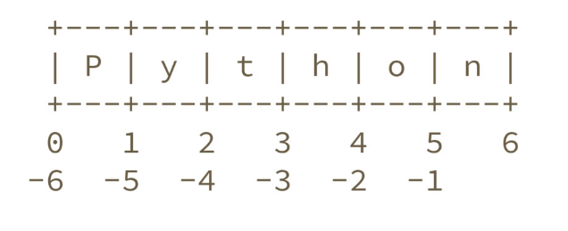

Variáveis
=========

Variável é um **nome** que se refere a um valor.

Atribuição
----------

Atribuição é o processo de criar uma nova variável e dar um novo valor a
ela. A seguir damos exemplos de como fazer atribuições:

.. code:: python

   >>> numero = 11
   >>> numero
   11

.. code:: python

   >>> frase = "Me dá um copo d'água"
   >>> frase
   "Me dá um copo d'água"

.. code:: python

   >>> pi = 3.141592
   >>> pi
   3.141592

No exemplo anterior realizamos três atribuições. No primeiro atribuimos um
número inteiro à variável de nome ``numero``; no segundo uma frase à
variável ``frase``; no último um número de ponto flutuante à ``pi``.

Nomes de Variáveis
------------------

Bons programadores escolhem nomes significativos para as suas variáveis
- eles documentam o propósito da variável.

Nomes de variáveis podem ter o tamanho que você achar necessário e podem
conter tanto letras como números, porém não podem começar com números. É
possível usar letras maiúsculas, porém a convenção é utilizar somente
letras minúsculas para nomes de variáveis.

.. code:: python

   >>> crieiumavariavelcomnomegiganteeestoucompreguiçadeescrevertudodenovo = 10
   >>> crieiumavariavelcomnomegiganteeestoucompreguiçadeescrevertudodenovo # use TAB para autocompletar =D
   10

Tentar dar um nome ilegal a uma variável ocasionará em um erro de sintaxe:

.. code:: python

    >>> 123voa = 10
      File "<stdin>", line 1
        123voa = 10
             ^
    SyntaxError: invalid syntax

.. code:: python

   >>> ol@ = "oi"
     File "<stdin>", line 1
       ol@ = "oi"
           ^
   SyntaxError: invalid syntax

.. code:: python

   >>> def = 2.7
     File "<stdin>", line 1
       def = 2.7
           ^
   SyntaxError: invalid syntax

``123voa`` é ilegal pois começa com um número. ``ol@`` é ilegal, pois
contém um caracter inválido (@), mas o que há de errado com ``def``?

A questão é que ``def`` é uma palavra-chave do Python e o interpretador
usa essas palavras para reconhecer a estrutura do programa e não podem ser
utilizadas como nomes de variável.

Outro ponto importante de notar é que não é possível acessar variáveis que
ainda não foram definidas:

.. code:: python

   >>> nao_definida
   Traceback (most recent call last):
     File "<stdin>", line 1, in <module>
   NameError: name 'nao_definida' is not defined

Tentar acessar uma variável sem definí-la anteriormente ocasiona em um "erro
de nome".

Também podemos atribuir expressões a uma variável:

.. code:: python

   >>> x = 3 * 5 - 2
   >>> x
   13
   >>> y = 3 * x + 10
   >>> y
   49
   >>> z = x + y
   >>> z
   62

.. code:: python

   >>> n = 10
   >>> n + 2 # 10 + 2
   12
   >>> 9 - n # 9 - 10
   -1

É importante lembrar que para mudar o valor de uma variável é preciso
utilizar a atribuição. Nos dois exemplos anteriores não atribuimos as
expressões à n, portanto seu valor continuou o mesmo.

Vamos alterar o valor de ``n``:

.. code:: python

   >>> n
   10
   >>> n = n + 2
   >>> n
   12
   >>> 9 - n
   -3

Outra forma de somar na variável:

.. code:: python

   >>> num = 4
   >>> num += 3
   >>> num
   7

Também funciona com multiplicação:

.. code:: python

   >>> x = 2
   >>> x *= 3
   >>> x
   6

Faça agora o :ref:`exercício 6 <ex_variaveis-basico>`

Strings (sequência de caracteres)
---------------------------------

.. code:: python

   >>> "Texto bonito"
   'Texto bonito'
   >>> "Texto coma centos de cedilhas: hoje é dia de caça!"
   'Texto coma centos de cedilhas: hoje é dia de caça!'

As *strings* aceitam áspas simples também:

.. code:: python

   >>> nome = 'Silvio Santos'
   >>> nome
   'Silvio Santos'

Também é possível fazer algumas operações com as strings:

.. code:: python

   >>> nome * 3
   'Silvio SantosSilvio SantosSilvio Santos'
   >>> nome * 3.14
   Traceback (most recent call last):
     File "<stdin>", line 1, in <module>
   TypeError: can't multiply sequence by non-int of type 'float'

.. code:: python

   >>> canto1 = 'vem aí, '
   >>> canto2 = 'lá '
   >>> nome + ' ' + canto1 + canto2 * 6 + '!!'
   'Silvio Santos vem aí, lá lá lá lá lá lá !!'

.. ' gambiarra aqui pro vim colorir bonitinho, tem alguma aspas abertas que buga. Essa linha é um comentário em rst.

Para strings em várias linhas, utilize 3 aspas:

.. code:: python

   >>> string_grange = '''Aqui consigo inserir um textão com várias linhas, posso iniciar em uma...
   ... e posso continuar em outra
   ... e em outra
   ... e mais uma
   ... e acabou.
   ... '''
   >>> string_grange
   'Aqui consigo inserir um textão com várias linhas, posso iniciar em uma...\ne posso continuar em outra\ne em outra\ne mais uma\ne acabou.\n'
   >>> print(string_grange)
   Aqui consigo inserir um textão com várias linhas, posso iniciar em uma...
   e posso continuar em outra
   e em outra
   e mais uma
   e acabou.

Tipos de objetos
----------------

Para saber o tipo de um objeto, usamos a função ``type``:

.. code:: python

   >>> x = 1
   >>> type(x)
   <class 'int'>
   >>> y = 2.3
   >>> type(y)
   <class 'float'>
   >>> type('Python')
   <class 'str'>
   >>> type(True)
   <class 'bool'>

Notação Científica
------------------

Notação científica em Python usa a letra ``e`` como sendo a
potência de 10:

.. code:: python

   >>> 10e6
   10000000.0
   >>> 1e6
   1000000.0
   >>> 1e-5
   1e-05

Também pode ser usada a letra ``E`` maiúscula:

.. code:: python

   >>> 1e6
   1000000.0

Tamanho
-------

A função embutida ``len()``, nos permite, entre outras coisas, saber o
tamanho de uma string:

.. code:: python

   >>> len('Abracadabra')
   11
   >>> palavras = 'Faz um pull request lá'
   >>> len(palavras)
   22

Índices
-------

Como visto anteriormente, o método len() pode ser utilizado para obter o
tamanho de estruturas, sejam elas strings, listas e etc. Esse tamanho
representa a quantidade de elementos na estrutura.

Para obter somente um caracter de dentro dessas estruturas, deve-se utilzar
o acesso por índices, no qual o índice entre colchetes [] representa a
posição do elemento que deseja-se acessar.

Nota: Os índices começam em zero.

.. code:: python

   >>> palavra = 'Python'
   >>> palavra[0] # primeira
   'P'
   >>> palavra[5] # última
   'n'

Índices negativos correspondem à percorrer a estrutura (string, lista,
...) na ordem reversa:

.. code:: python

   >>> palavra[-1] # última também
   'n'
   >>> palavra[-3] # terceira de tras pra frente
   'h'

Fatias
------

Se invés de obter apenas um elemento de uma estrutura (string, lista,
...) deseja-se obter multiplos elementos, deve-se utilizar *slicing*
(fatiamento). No lugar de colocar o índice do elemento entre chaves,
deve-se colocar o índice do primeiro elemento, dois pontos (:) e o
proximo índice do último elemento desejado, tudo entre chaves.

.. code:: python

   >>> frase = "Aprender Python é muito divertido!"
   >>> frase[0:5] # do zero até o 5
   'Apren'
   >>> frase[:] # tudo!
   'Aprender Python é muito divertido!'
   >>> frase
   'Aprender Python é muito divertido!'
   >>> frase[6:] # Se omitido o segundo índice significa 'obter até o final'
   'er Python é muito divertido!'
   >>> frase[:6] # se omitido o primeiro indice, significa 'obter desde o começo''Aprend'
   >>> frase[2:-3] # funciona com números negativos também
   'render Python é muito diverti'
   >>> frase[0:-5]
   'Aprender Python é muito diver'
   >>> frase[2:-2]
   'render Python é muito divertid'
   >>> frase[2:-2:2] # pode-se ecolher o passo com que o slice é feito
   'rne yhnémiodvri'

Faça agora os :ref:`exercício 7 e 8 <ex_variaveis-basico>`
