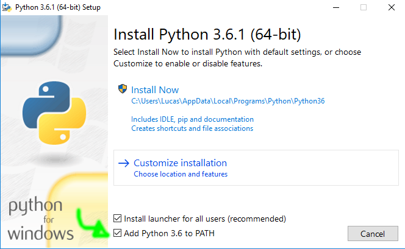
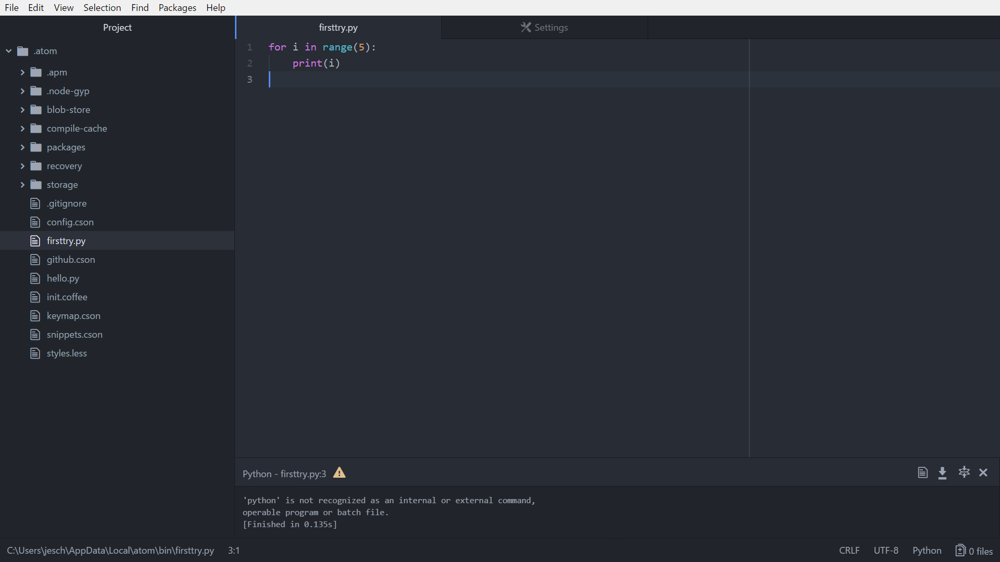
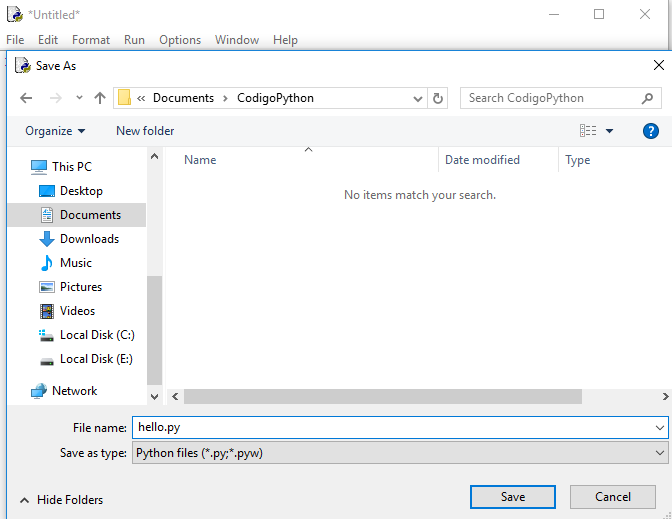
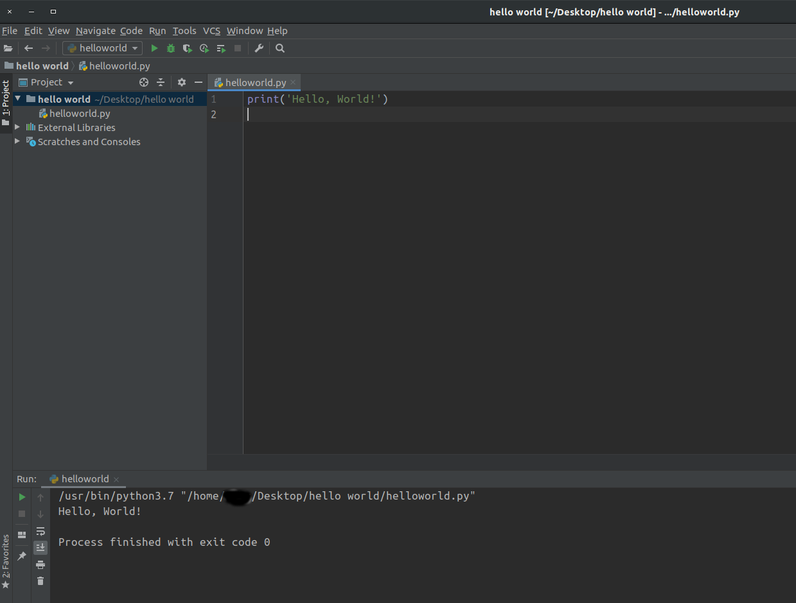
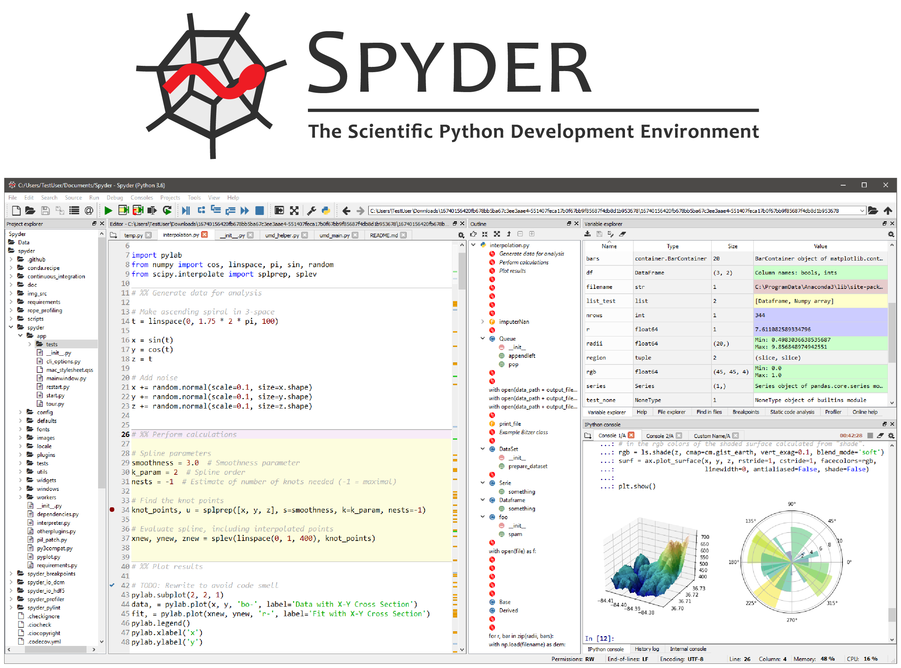
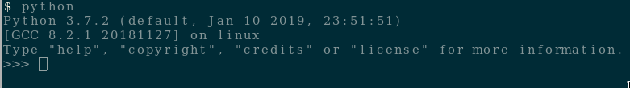
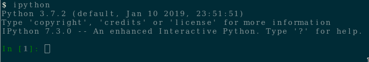

.. _intro-instalacao:

Guia de Instalação do Python
============================

Linux
-----

Provavelmente você já tem o Python instalado e configurado. Para ter certeza
que ele está instalado e descobrir qual versão, abra um terminal e execute o
comando:

.. code-block:: bash

   $ python --version

Se o resultado do comando for `Python 3.6.5` (ou alguma versão igual ou
superior a `3.5`) o Python já está instalado corretamente.

Caso o resultado do comando anterior tenha sido `Python 2.7.13` (ou qualquer
versão do `Python 2`) tente rodar o seguinte comando, pois seu computador
pode ter ambas versões `2` e `3` instaladas:

.. code-block:: bash

    $ python3 --version

Caso tenha aparecido a mensagem ``bash: python: command not found``, você pode
instalá-lo da seguinte maneira:

No Ubuntu e Debian
~~~~~~~~~~~~~~~~~~

.. code-block:: bash

   $ sudo apt install python3

No ArchLinux
~~~~~~~~~~~~

.. code-block:: bash

   $ sudo pacman -Sy python

Mac OS X
--------

Obtenha o instalador na sessão de downloads para `Mac OS X do Python`_. Clique
duas vezes no ``Python.mpkg`` para abrir o instalador.

Para ter certeza que ele está instalado e descobrir qual versão, abra um
terminal e execute o comando:

.. code-block:: bash

   $ python --version
   Python 3.6.5

.. _Mac OS X do Python: https://www.python.org/downloads/

Windows
-------

Obtenha o arquivo de instalação última versão compatível com a arquitetura do
seu computador no `site oficial do Python`_. O arquivo `x86` provavelmente
funcionará para todos computadores.

A seguir, execute o instalador e uma imagem similar a essa aparecerá:

Deve ser selecionada a opção ``Add Python 3.6 to PATH`` e depois continuar a
instalação até o fim.

.. _site oficial do Python: https://www.python.org/downloads/

Ambientes de Desenvolvimento
============================

Há diversos programas para desenvolvermos códigos, alguns são mais bonitinhos,
outros são mais poderosos, alguns são mais simples, outros são mais amigáveis.
Dê uma olhada nesta seção e escolha o que você achar mais interessante. Somente
você pode responder à pergunta "Qual o melhor ambiente de desenvolvimento para
*mim*?"

IDE (*Integrated Development Environment* - Ambiente de Desenvolvimento Integrado, em português)
é um editor de texto que possui ferramentas e recursos que facilitam a vida do programador.
Entre as ferramentas e recursos, podemos citar:

- Identificar quais variáveis foram declaradas.
- Identificar erros no código.
- Personalizar o ambiente de trabalho.
- Ocultar parte do código para melhor visualização.

Ambientes gráficos
------------------

ATOM
~~~~

O programa ATOM é um IDE *open-source* que apresenta diversos pacotes para personalizar.

No site oficial do `ATOM <https://atom.io>`_, você encontrará um link para a Documentação do programa.
Na documentação, é possível acessar o `manual <https://flight-manual.atom.io/getting-started/sections/installing-atom/#platform-windows>`_ que mostrará passo a passo como instalar o programa (tanto para Windows como para Linux).

Caso você tenha alguma dúvida, é aconselhável entrar na seção de `discusão <https://discuss.atom.io/>`_. Nessa página, você encontrará respostas para diversas dúvidas, e possivelmente, para a sua.

IDLE
~~~~

Para usuários Windows é recomendado utilizar o `IDLE`. Ele é composto pelo interpretador do Python e um editor de texto para criar programas, e já vem junto com o Python.
Após seguir o :ref:`intro-instalacao`, o menu inicial deve estar da seguinte
forma:

.. figure:: images/idle1.png
   :align: center
   :width: 80%

Ao abrir o `IDLE (Python 3.X)`, aparecerá uma janela como na
imagem abaixo:

.. figure:: images/idle2.png
   :align: center
   :width: 80%

No `IDLE` é possível digitar comandos para o interpretador do Python e, também,
é possível criar e digitar em um arquivo. Para fazer isso, no menu clique em
`File` -> `New File` (Ou pressione as teclas `Ctrl` + `N` juntas)

.. figure:: images/idle3.png
   :align: center
   :width: 80%

Para rodar um programa, clique em `Run` -> `Run Module` (Ou aperte a tecla `F5`)

.. figure:: images/idle4.png
   :align: center
   :width: 80%

Caso o arquivo ainda não tenha sido salvo, é necessário salvá-lo antes de
executá-lo. Não esqueça de prefixar o nome do arquivo com `.py`
(extensão do Python):

Após isso, o resultado da execução do código deve aparecer na janela anterior do `IDLE`:

.. figure:: images/idle6.png
   :align: center
   :width: 80%

PyCharm
~~~~~~~~~~~~~~~~~~
Esta IDE é voltada especificamente para a linguagem Python. No `site oficial <https://www.jetbrains.com/pycharm/>`_ é possível encontrar orientações para realizar o download e instalação (Linux, Mac, Windows).

É desenvolvido pela empresa tcheca JetBrains. Fornece análise de código, um depurador gráfico, teste de unidade integrado, integração com sistemas de controle de versão, ambiente virtual e suporta o desenvolvimento da Web com o Django, bem como Data Science com o Anaconda (`Wikipedia <https://en.wikipedia.org/wiki/PyCharm>`_).

Spyder
~~~~~~

O Spyder é uma IDE perfeita para quem utiliza o Python para Ciência de Dados, especialmente porque vem incluso no *Anaconda*, um pacote de várias bibliotecas e ferramentas voltadas para essa área.

Ele possui uma interface simples, com uma tabela de variáveis para fácil inspeção dos valores de cada variável no programa durante sua depuração.

A melhor forma de instalá-lo é pela instalação do `Anaconda <https://www.anaconda.com/distribution/>`_. Novamente, recomenda-se utilizar essa forma de instalação apenas para quem deseja utilizar todos os pacotes inclusos no Anaconda, e não apenas o Spyder.

Visual Studio Code
~~~~~~~~~~~~~~~~~~

O Visual Studio Code por si só é um editor de texto criado pela Microsoft que apresenta diversos pacotes para personalizá-lo da forma que você precisa.

.. figure:: images/ide_vsc.png
   :align: center
   :width: 80%

No site oficial do `Visual Studio Code <https://code.visualstudio.com/>`_, você encontrará um link para a Documentação do programa.

Na documentação, é possível acessar o `manual de Python <https://code.visualstudio.com/docs/languages/python>`_ que mostra todos as funcionalidades que o programa possui relacionadas a Python.

Para um passo-a-passo da instalação, você pode encontrar os detalhes de cada sistema operacional `nesta página do manual <https://code.visualstudio.com/docs/setup/setup-overview>`_.

Linha de comando
----------------

Existe também a possibilidade de trabalhar sem um ambiente gráfico, utilizando apenas a *interface de linha de comando*.

Python Shell
~~~~~~~~~~~~

Se você instalou corretamente o Python, você tem à sua disposição um interpretador interativo, popularmente conhecido como *o Shell do Python*.

Se você utiliza Linux ou Mac, basta abrir um terminal e digitar ``python``. Caso utilize Windows, deverá existir uma pasta no menu *iniciar* chamada ``Python 3.7`` (ou ``Python 3.6``) que permite abrir o interpretador. Caso tenha sucesso, você deverá encontrar algo similar a esta imagem:

Para sair do Python, digite ``quit()``. Isso encerra a seção interativa e te retorna ao terminal (ou fecha a tela preta, no caso do Windows).

Note que, ao entrar no interpretador, a primeira linha começa com ``Python 3.7.2``. Essa é a versão utilizada do Python. Neste curso utilizamos a versão ``3.6`` ou mais recente. Caso a versão que aparecer em seu interpretador seja ``2.7.6``, encerre a seção e tente o comando ``python3`` para utilizar a versão ``3`` do Python.

IPython
~~~~~~~

`IPython`_ é um Shell alternativo para o Python, bem poderoso. E colorido também, ao contrário do `shell` nativo do Python.

.. _IPython: https://ipython.org
