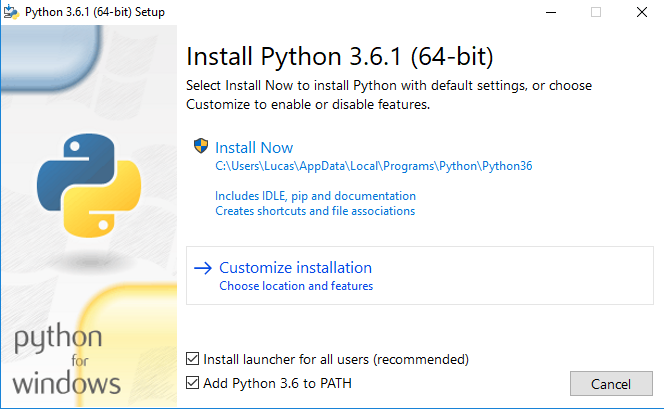

Instalando Python
=================

Linux - Ubuntu
--------------

Provavelmente você já tem o Python instalado e configurado. Para ter certeza
que ele está instalado e descobrir qual versão, abra um terminal e execute o
comando:

.. code::

   $ python --version

Se o resultado do comando for `Python 3.6.1` (ou alguma versão igual ou
superior a `3.5`) o Python já está instalado corretamente.

Caso o resultado do comando anterior tenha sido `Python 2.7.13` (ou qualquer
versão do `Python 2`) tente rodar o seguinte comando, pois seu computador
pode ter ambas versões `2` e `3` instaladas:

.. code::

    $ python3 --version

Caso tenha aparecido a mensagem ``bash: python: command not found``, você pode
instalá-lo da seguinte maneira:

.. code::

   $ sudo apt install python3.6

Mac OS X
--------

Obtenha o instalador na sessão de downloads para `Mac OS X do Python`_. Clique
duas vezes no Python.mpkg para abrir o instalador.

Para ter certeza que ele está instalado e descobrir qual versão, abra um
terminal e execute o comando:

.. code::

   $ python --version
   Python 3.6.1

Windows
-------

Primeiramente, deve-se obter o arquivo de instalação compatível com a
arquitetura. O arquivo x86 provavelmente funcionará para todos computadores,
os links estão a seguir:

    - x86_64_
    - x86_

A seguir, o aquivo deve ser executado e a seguinte imagem aparecerá:

Deve ser selecionado a opção `Add Python 3.6 to PATH`, e deve ser clicado na
opção 'Customize installation'

.. figure:: images/install2.png
   :align: center
   :scale: 80%

Clique em 'Next'

.. figure:: images/install3.png
   :align: center
   :scale: 80%

Selecionar a opção `Install for all users` e clicar em `Install`. Então, uma
janela pedindo permissão de administrador deve aparecer, é necessário aceitar

.. figure:: images/install4.png
   :align: center
   :scale: 80%

Selecione `Disable path lenght limit` e, novamente, uma janela de permissão de
administrador irá aparecer, é necessário aceitar

.. figure:: images/install5.png
   :align: center
   :scale: 80%

Clique em `Close`

Parabéns, agora o Python está intalado em sua máquina!

.. _Mac OS X do Python: https://www.python.org/downloads/mac-osx/
.. _x86_64: https://www.python.org/ftp/python/3.6.1/python-3.6.1-amd64.exe
.. _x86: https://www.python.org/ftp/python/3.6.1/python-3.6.1.exe
