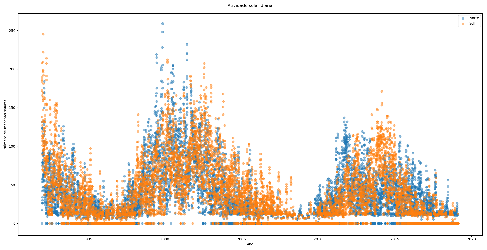

O que é *Python*?
=================

.. colocar aqui uma motivação sobre pq python é foda!

   Histórico resumido da linguagem

   pq usar python?

*Python* é uma *linguagem de programação*. Isso significa basicamente duas coisas:

1. existem regras que determinam como as palavras são dispostas, já que é uma *linguagem*;

2. o texto descreve *instruções* para o computador realizar tarefas.

Ou seja, podemos escrever um documento - que chamamos de *código fonte* - em Python para o computador ler e realizar nossos desejos e tarefas. Python tem algumas características interessantes:

* é *interpretada*, ou seja, o interpretador do Python executa o código fonte diretamente, traduzindo cada trecho para instruções de máquina;

* é de *alto nível*, ou seja, o interpretador se vira com detalhes técnicos do computador. Assim, desenvolver um código é mais simples do que em linguagens de *baixo nível*, nas quais o programador deve se preocupar com detalhes da máquina;

* é de *propósito geral*, ou seja, podemos usar Python para desenvolver programas em diversas áreas. Ao contrário de linguagens de domínio específico, que são especializadas e atendem somente a uma aplicação específica;

* tem *tipos dinâmicos*, ou seja, o interpretador faz a magia de descobrir o que é cada variável.

Por essas e várias outras características, Python se torna uma linguagem simples, bela, legível e amigável. É uma linguagem utilizada por diversas empresas, como  Wikipedia, Google, Yahoo!, CERN, NASA, Facebook, Amazon, Instagram, Spotify... [1]_

Exemplos
--------

Vamos ver alguns exemplos sobre o uso de Python no mundo real.

BitTorrent
~~~~~~~~~~

O protocolo *Torrent* é muito utilizado para transferir quantidades grandes de dados para diversos computadores. O primeiro programa a implementar esse protocolo foi desenvolvido inteiramente em Python, pela *BitTorrent, Inc.*! [2]_

Django
~~~~~~

*Django* é um conjunto de pacotes para desenvolvimento web. E é baseado em Python :)

um objetivo de Django é desenvolver facilmente websites complexos e que lidam com bancos de dados grandões. Alguns sites desenvolvidos em Django: Instagram,  The Washington Times, Disqus, Mozilla, National Geographic. [6]_

Dropbox
~~~~~~~

O popular serviço de armazenamento de dados em Nuvem *Dropbox* tem diversas partes da infraestrutura feita em Python. [5]_ O aplicativo para computadores é feito em Python e grande parte da infra estrutura dos servidores deles também é!

Estudo sobre erupções solares
~~~~~~~~~~~~~~~~~~~~~~~~~~~~~

Não somente a indústria utiliza Python, muitos pesquisadores utilizam em diversas áreas científicas.

É possível de modo bem simples estudar as erupções solares desde 1992 até hoje. O Observatório Real da Bélgica tem um banco de dados sobre o número de manchas solares, e disponibilizam online para estudos. [4]_ Veja como é o código para visualizar a atividade solar desde 01/01/1992 em cada parte (norte e sul) do Sol:

.. code::

   import pandas as pd     # isso aqui gerencia os dados
   import matplotlib.pyplot as plt    # isso aqui permite fazer gráficos

   # pega os dados solares de WDC-SILSO, Royal Observatory of Belgium, Brussels
   sun = pd.read_table('http://sidc.oma.be/silso/INFO/sndhemcsv.php', sep=';', encoding = "ISO-8859-1", header=-1)

   # faz o gráfico de cada hemisfério do sol
   fig = plt.figure()
   plt.scatter(sun[3], sun[5], label='Norte', alpha=0.5)
   plt.scatter(sun[3], sun[6], label='Sul', alpha=0.5)

   plt.title("Atividade solar diária\n")
   plt.ylabel('Número de manchas solares')
   plt.xlabel('Ano')
   plt.legend(loc='upper right')

   plt.show()

E o resultado desse código é a seguinta imagem:

   Erupções solares desde 1992, separadas por hemisférios (norte e sul) do Sol.

The Sims 4
~~~~~~~~~~

O jogo *The Sims 4* tem partes feitas em Python [3]_. Isso permite o desenvolvimento de *mods* para o jogo em Python \\o/

   Capa do jogo The Sims 4, da Electronic Arts.

.. [1] Lista compilada pela página da `Wikipedia sobre Python <https://en.wikipedia.org/wiki/Python_(programming_language)#Uses>`_, em inglês.

.. [2] https://en.wikipedia.org/wiki/BitTorrent_(software)#History

.. [3] https://en.wikipedia.org/wiki/The_Sims_4#Development

.. [4] http://sidc.oma.be/silso/home

.. [5] https://en.wikipedia.org/wiki/Dropbox_(service)#Technology

.. [6] https://www.djangoproject.com/start/overview/
