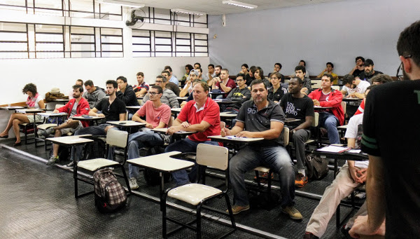
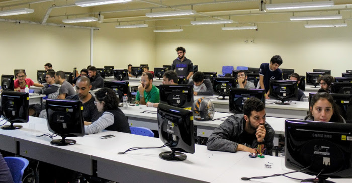
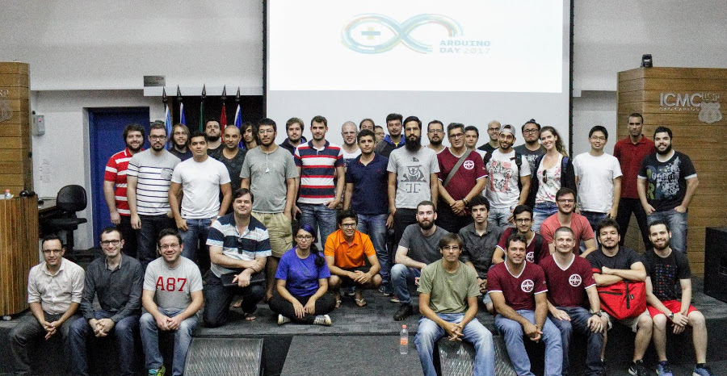
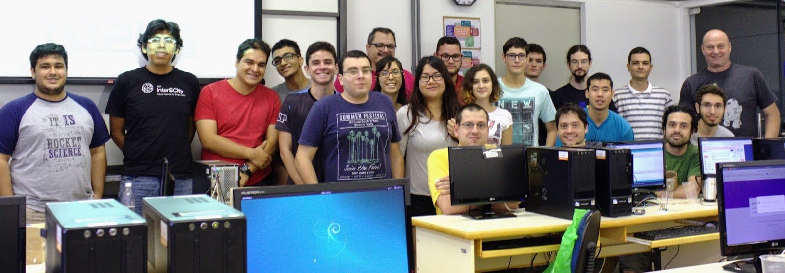

Sobre o grupy-sanca
===================

O grupy-sanca (Grupo Usuários Python de São Carlos) reúne pessoas interessadas
em desenvolvimento de software e na linguagem Python. Realizamos periodicamente
diversos eventos, dentre eles:

Cursos e workshops de programação
---------------------------------

.. figure:: images/sobre/curso01.jpg
   :align: center
   :width: 70%

.. figure:: images/sobre/curso02.jpg
   :align: center
   :width: 70%

.. figure:: images/sobre/curso03.jpg
   :align: center
   :width: 70%

.. figure:: images/sobre/curso04.jpg
   :align: center
   :width: 70%

Palestras
---------

.. figure:: images/sobre/palestras01.jpg
   :align: center
   :width: 70%

.. figure:: images/sobre/palestras02.jpg
   :align: center
   :width: 70%

Coding Dojos
------------

.. figure:: images/sobre/dojo01.jpg
   :align: center
   :width: 70%

.. figure:: images/sobre/dojo02.jpg
   :align: center
   :width: 70%

Eventos
-------

Sprints
-------

.. figure:: images/sobre/sprint01.jpg
   :align: center
   :width: 70%

.. figure:: images/sobre/sprint02.jpg
   :align: center
   :width: 70%

Encontros casuais
-----------------

.. figure:: images/sobre/bar01.jpg
   :align: center
   :width: 70%

.. figure:: images/sobre/bar02.jpg
   :align: center
   :width: 70%

História
--------

O grupo foi fundado em 28/06/2016 e desde então já tivemos:

- 18+ Coding Dojos

- 20+ PyBares

- 15+ Cursos e workshops

-  6  PyLestras

-  3  Eventos

-  2  Sprints

Além disso, chegamos nos 942+ inscritos no Meetup!

Para saber mais sobre os eventos organizados pelo grupy-sanca acesse:

  - `Site oficial <http://www.grupysanca.com.br>`_

    .. only:: latex

       www.grupysanca.com.br

  - `Facebook <https://www.facebook.com/grupysanca/>`_

    .. only:: latex

       facebook.com/grupysanca

  - `Meetup <https://www.meetup.com/grupy-sanca>`_

    .. only:: latex

       meetup.com/grupy-sanca

  - `Telegram <https://t.me/grupysanca>`_

    .. only:: latex

       t.me/grupysanca
