Sobre o grupy-sanca
===================

O *grupy-sanca* (Grupo de Usuários Python de São Carlos) é uma comunidade que
reúne pessoas interessadas em desenvolvimento de *software* e na linguagem
Python. Prezamos pela troca de conhecimento, respeito mútuo e diversidade
(tanto de opinião quanto de tecnologias).

Somos um grupo da cidade de São Carlos (SP) e região. Realizamos
periodicamente diversos eventos.

Atividades
----------

Cursos e oficinas de programação
~~~~~~~~~~~~~~~~~~~~~~~~~~~~~~~~

Oferecemos cursos básicos de Python e também sobre alguns assuntos específicos. Durante os cursos os membros do grupy se voluntariam para serem monitores e ajudam a solucionar eventuais dúvidas dos participantes.

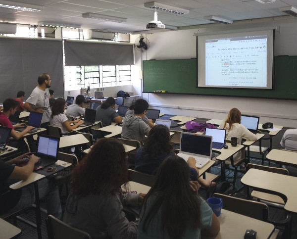

   Nosso primeiro curso de Python \\o/

   Realizado em 25 de março de 2017, no ICMC - USP - São Carlos.
   Tivemos ~200 inscritos! 81 participantes! 4 ministrantes! 8 monitores!!
   2 *coffee-breaks*! 4 garrafas térmicas: café e chá!

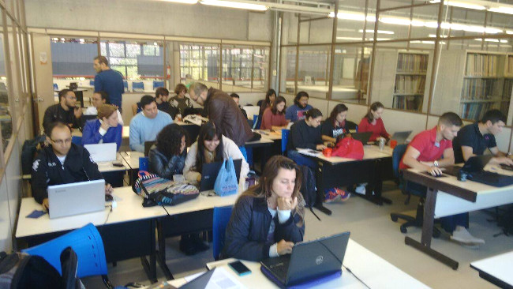

   Curso de Python básico no IFSC!

   Realizado em 01 de Julho de 2017, no IFSC - USP - São Carlos.
   Tivemos ~100 inscritos! 38 participantes! 2 ministrantes! 3 monitores!!
   2 *coffee-breaks*! 2 garrafas térmicas com apenas café :P

Também aceitamos convites para ministrar nossos cursos em eventos, como semanas acadêmicas.

.. figure:: images/sobre/curso03.jpg
   :align: center
   :width: 70%

   Curso de Python básico na UNESP de Rio Claro!!

   Fez parte da programação da SECCOMP 2017, em 23 de Outubro de 2017.

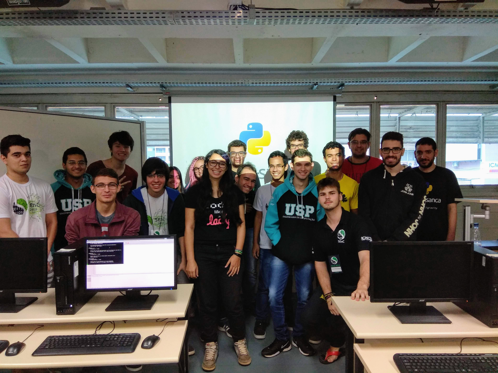

   Curso de Python básico na USP de São Carlos!!

   Fez parte da programação da SEnC 2018, em 24 de Outubro de 2018.

Pylestras
~~~~~~~~~

Evento com o objetivo de reunir a comunidade, compartilhar conhecimento e
divulgar novas tecnologias. É tradicionalmente composto por palestras rápidas (~17 minutos), onde obrigatoriamente uma delas não é sobre Python.

Qualquer pessoa interessada pode submeter uma palestra, independentemente do tema ser para iniciantes ou usuários avançados. Para deixar a escolha democrática, costumamos usar o `Speakerfight <https://speakerfight.com/profile/grupysanca/>`_, onde a própria comunidade escolhe as palestras que acha mais interessantes.

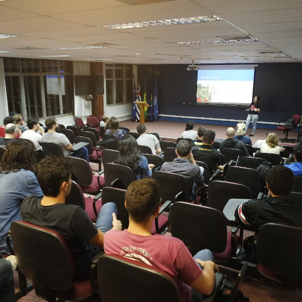

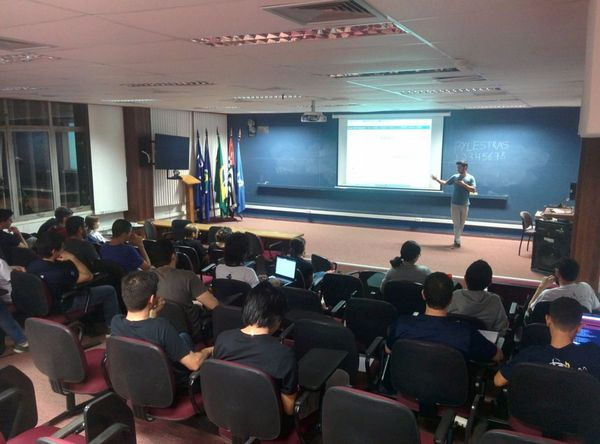

Coding Dojos
~~~~~~~~~~~~

É um espaço para que as pessoas possam aprender, treinar e aprimorar suas
habilidades em programação. O `coding dojo` é um ótimo lugar para aprender
coisas novas.

Em um `coding dojo` são propostos vários desafios e os participantes
selecionam quais querem resolver. Após escolherem o desafio, as pessoas leem
o problema, entendem e discutem como resolvê-lo. Com esses pontos resolvidos,
começa a programação da solução. O desenvolvimento é feito em apenas um
computador por duas pessoas programando por vez (`pair programming`). Sendo que
a cada intervalo de 5 minutos as pessoas à frente do computador dão lugar para
outras.

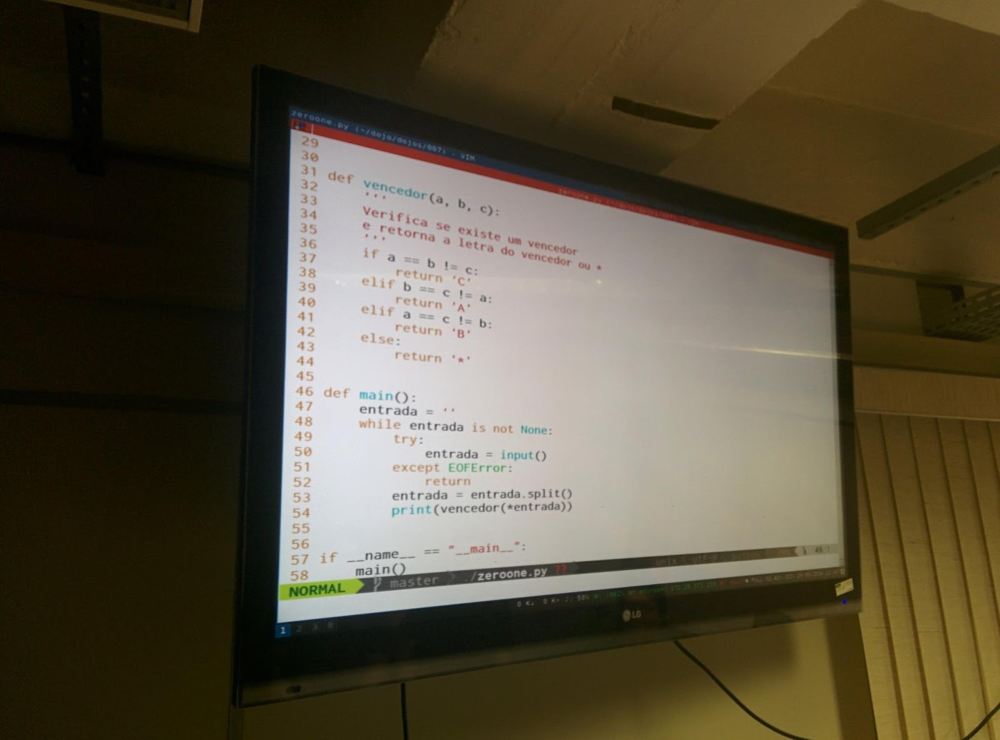

Para o dojo fluir bem, adota-se o TDD (`Test Driven Development`), pois assim
as pessoas pensam melhor em como o código será utilizado antes de desenvolver.
Também segue-se o desenvolvimento por `baby steps` em que tenta-se dividir o
problema em partes menores para resolvê-lo.

Ao término do dojo acontece uma retrospectiva em que as pessoas respondem
três perguntas básicas: *o que foi aprendido?*; *o que pode ser melhorado?*
e *o que deve continuar a ser feito?*. Isso serve para os participantes
melhorarem nos dojos futuros. Por experiência do grupy-sanca, fazer isso
realmente vale a pena :)

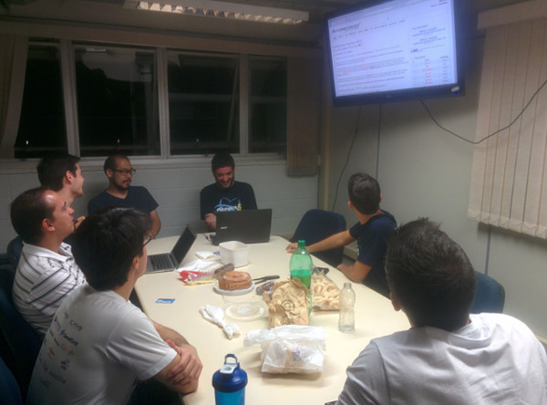

   Antes ou depois do coding dojo acontece um coffee break comunitário. Mas já
   aconteceu de ser durante também...

Eventos
~~~~~~~

O grupy-sanca também organiza eventos singulares, únicos no universo!

Um dos maiores eventos realizados pela comunidade foi o `Caipyra 2018 <2018.caipyra.python.org.br>`_, o único evento de Python com quentão e paçoquinha, que tem por objetivo ser uma conferência de Python voltada ao público do interior do estado de São Paulo.

Após duas edições sediadas em Ribeirão Preto, o grupy-sanca trouxe o evento para São Carlos em 2018 (e já está organizando a edição de 2019).

.. figure:: images/sobre/caipyras01.jpg
   :align: center
   :width: 70%

   Tivemos 237 participantes, 16 palestras e 3 tutoriais

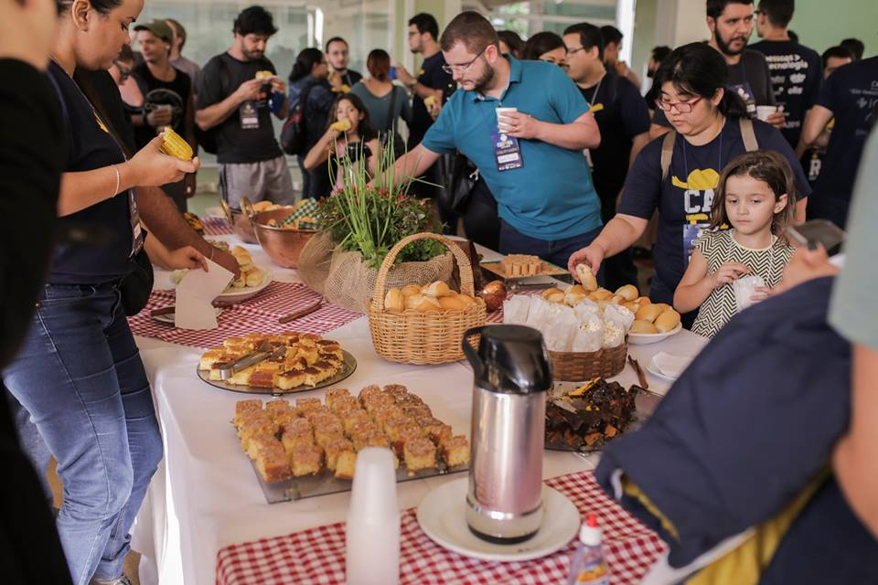

   Foram consumidos ~40 litros de quentão e 1625 paçoquinhas

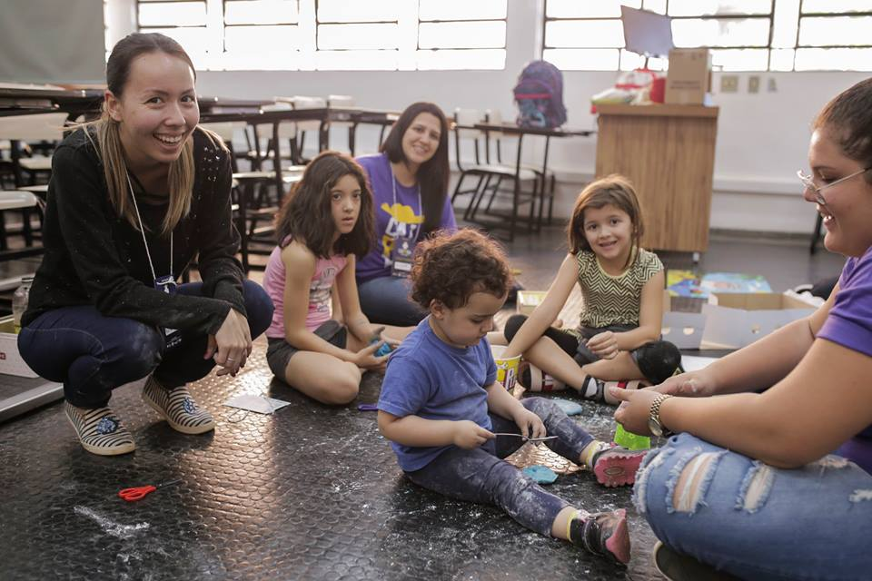

   Oferecemos um espaço infantil para os papais e mamães poderem participar do evento

.. figure:: images/sobre/caipyras04.jpg
   :align: center
   :width: 70%

   Tudo isso feito com muito carinho pelos membros do grupy-sanca <3

Sprints
~~~~~~~

Sprints são maratonas de programação. Um grupo de pessoas se junta no
mesmo lugar para desenvolver algum projeto novo, resolver *bugs*
de algum software, ou implementar alguma funcionalidade nova.

Durante os sprints, usuários iniciantes podem aprender como contribuir com projetos open source, sendo um ambiente ideal para ter contato com pessoas mais experientes e aprender boas práticas.

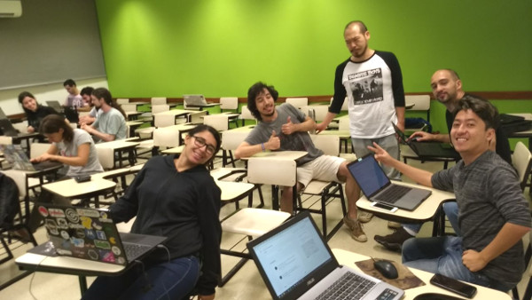

   *Hacktoberfest* de 2017 :)

   Fizemos cerca de 50 *commits* esse dia \o/

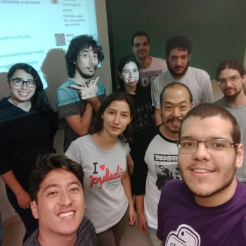

Encontros casuais
~~~~~~~~~~~~~~~~~

Também conhecidos como PyBares :)

A ideia é bater um papo sobre a vida, o universo e tudo mais e tomar uma
cerveja (ou não).

A comunidade Python vai muito além de escrever código Python, participar de
oficinas/minicursos ou realizar encontros técnicos. Os encontros no bar tem
como objetivo conectar pessoas e prover uma conversa descontraída entre os
participantes.

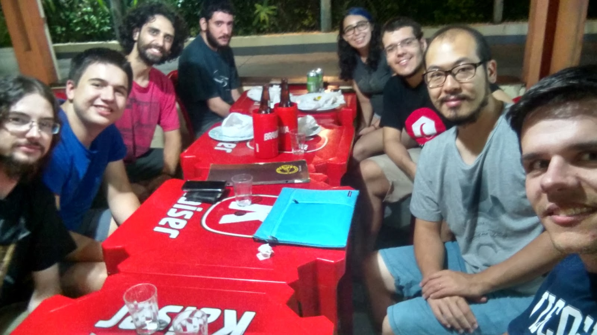

E em algumas situações, combinamos de conversar apenas *in english*!

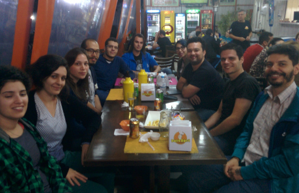

Histórico
---------

O grupo foi fundado em 28/06/2016 e desde então já tivemos:

- 21+ Coding Dojos

- 25+ PyBares

- 16+ Cursos e workshops

-  7  PyLestras

-  4  Eventos

-  3  Sprints

Além disso, chegamos nos 1082+ inscritos no Meetup!

Para saber mais sobre os eventos organizados pelo grupy-sanca acesse:

  - `Site oficial <http://www.grupysanca.com.br>`_

    .. only:: latex

       www.grupysanca.com.br

  - `Facebook <https://www.facebook.com/grupysanca/>`_

    .. only:: latex

       facebook.com/grupysanca

  - `Instagram <https://www.instagram.com/grupysanca/>`_

    .. only:: latex

       instagram.com/grupysanca/

  - `Telegram <https://t.me/grupysanca>`_

    .. only:: latex

       t.me/grupysanca

  - `Meetup <https://www.meetup.com/grupy-sanca>`_

    .. only:: latex

       meetup.com/grupy-sanca

  - `YouTube <https://www.youtube.com/channel/UC9AED1x6Nn10lu-3rNELQnw>`_

    .. only:: latex

       youtube.com/channel/UC9AED1x6Nn10lu-3rNELQnw

  - `GitHub <https://github.com/grupy-sanca>`_

    .. only:: latex

       github.com/grupy-sanca

.. spelling::

   grupysanca
   br

Ou entre em contato através do nosso email: contato `@` grupysanca `.` com `.` br
